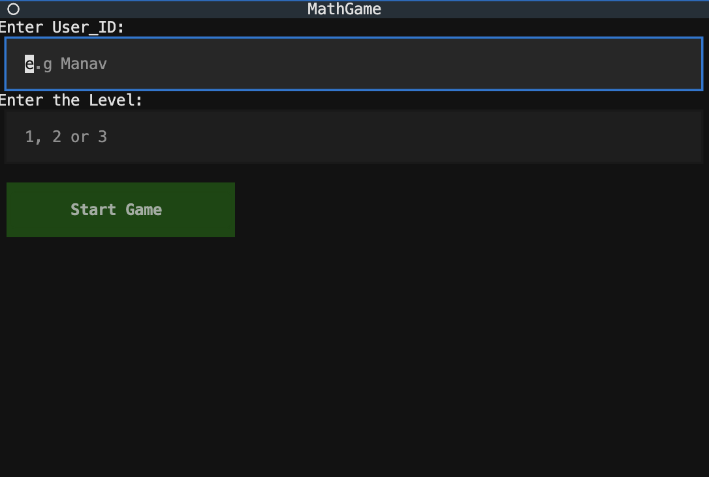
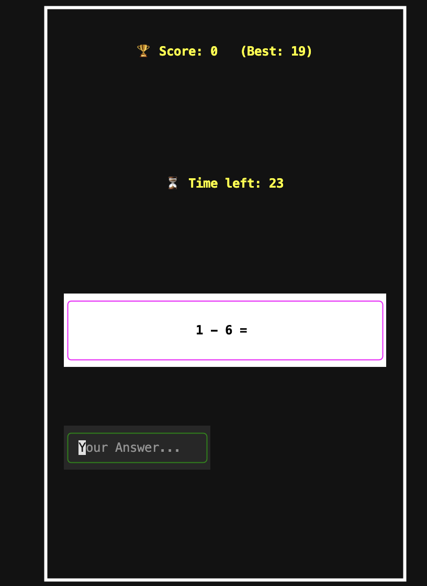
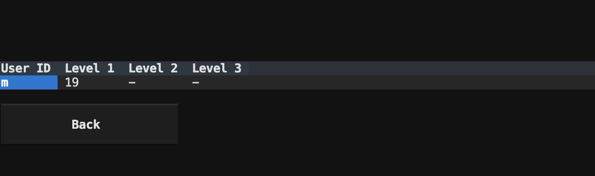

# MathGame 🎮➕✖️➖➗

A terminal-based math quiz game built with [Textual](https://github.com/Textualize/textual).  
Players can select a user ID and difficulty level, then solve randomly generated math problems under a countdown timer.  
High scores are saved per user and level in a local JSON file.

---

## ✨ Features

-  Random math problems (addition, subtraction, multiplication, division).
-  Countdown timer to make the game more challenging.
-  Per-user high scores (saved locally in `high_scores.json`).
-  Styled interface with Textual CSS.
-  High Scores screen with a table view.
-  Play Again, Main Menu, and High Score navigation.

---

## How to Run

1. **Clone this repository**
   ```bash
   git clone https://github.com/your-username/mathgame.git
   cd mathgame
   ```

2. **Install dependencies**
   Requires Python 3.9+ and Textual:
   ```bash
   pip install textual
   ```

3. **Run The Game**
   ```bash
   python math_game.py
   ```


## Gameplay

Enter your User ID (e.g., your name or initials).

Enter a Level:

  1 → Easier (smaller numbers).
  
  2 → Medium.
  
  3 → Hard (bigger numbers).

Answer math questions before the timer runs out!

When the timer ends, your score is saved and you can view highscores (stored using JSON).

## Project Structure

.
├── math_game.py       # Main game code
├── math_game.tcss     # Textual CSS (styling of the UI)
├── screenshots/       # Screenshots for README (you need to add this)
│   ├── setup.png
│   ├── game.png
│   └── gameover.png
├── high_scores.json   # Stores best scores (auto-created)    
└── README.md          # Project documentation (THIS FILE)


## Pictures from the Game


### Setup Screen


### Game Screen


### High Scores


